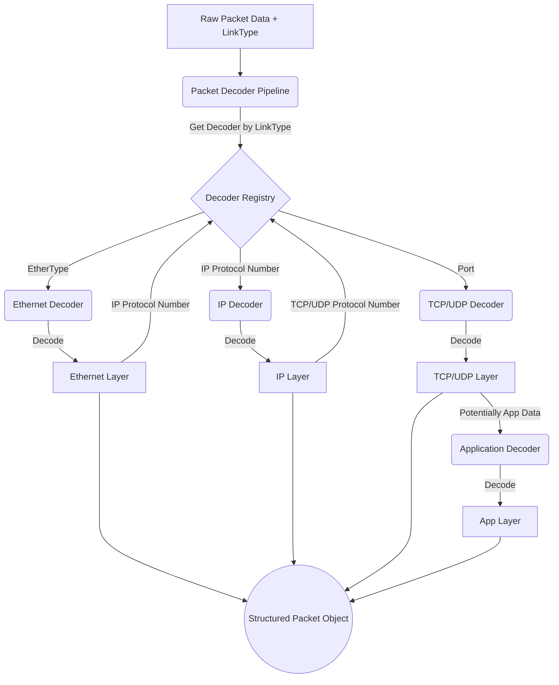

## Project Plan: `pcap-decoder-ts`

This plan outlines the development tasks required to build the `pcap-decoder-ts` library as specified in the PRD. Each phase includes tasks for development and corresponding test creation.

---

### Phase 0: Project Setup & Foundational Elements

This phase focuses on setting up the development environment, basic project structure, and core utilities that will be used throughout the project.

- **Task 0.1: Initialize Project**

  - Description: Set up a new TypeScript project using `npm`.
  - Sub-tasks:
    - Initialize `package.json` using `npm init`.
    - Install TypeScript as a dev dependency: `npm install --save-dev typescript`.
    - Configure `tsconfig.json` (target ESNext for Node.js, consider browser compatibility, strict mode enabled).
    - Set up a linter (e.g., ESLint) and a formatter (e.g., Prettier) with TypeScript support.
  - TDD: N/A (Configuration task)

- **Task 0.2: Choose and Configure Testing Framework**

  - Description: Select and integrate a testing framework (Jest or Vitest as per PRD). Given the choice of Vite for bundling, Vitest is a natural fit.
  - Sub-tasks:
    - Install Vitest: `npm install --save-dev vitest`.
    - Configure Vitest to work with TypeScript (often minimal configuration needed with Vite).
    - Write a simple placeholder test to ensure the setup is working.
  - TDD: Write a basic "true is true" test to confirm framework integration.

- **Task 0.3: Setup Build System**

  - Description: Configure the TypeScript compiler (`tsc`) for type checking and declaration file generation, and `Vite` for development server and production bundling.
  - Sub-tasks:
    - Install Vite: `npm install --save-dev vite`.
    - Configure `vite.config.ts` for library mode.
    - Define `npm` scripts for `dev` (using Vite), `build` (using Vite and `tsc` for declarations), `test` (using Vitest), `lint`, `format`.
    - Ensure `tsc` outputs declaration files (`.d.ts`) as part of the build process, and Vite bundles for different formats (ESM, UMD/IIFE).
  - TDD: N/A (Configuration task)

- **Task 0.4: Define Core Data Structures and Utilities**

  - Description: Create foundational data structures and utility functions for byte manipulation, error handling, and logging.
  - Sub-tasks:
    - Define a custom error class hierarchy for parsing and decoding errors.
    - Implement utility functions for reading various integer types (uint8, int8, uint16, int16, uint32, int32, etc.) from a `Buffer` or `DataView` in both big-endian and little-endian formats.
    - Implement utility functions for IP address formatting (IPv4, IPv6).
    - Define basic logging/warning mechanisms for issues like corrupted packets.
  - TDD:
    - Write tests for each byte reading utility function (e.g., `readUint16BE`, `readUint32LE`) with various inputs, including edge cases and buffer boundaries.
    - Write tests for IP address formatting utilities.
    - Write tests for custom error classes.

- **Task 0.5: Version Control Setup**
  - Description: Initialize a Git repository and define a branching strategy (e.g., Gitflow).
  - Sub-tasks:
    - `git init`.
    - Create a `.gitignore` file (for `node_modules`, `dist`, OS-specific files).
    - Define initial branches (e.g., `main`, `develop`).
  - TDD: N/A (Configuration task)

---

### Phase 1: PCAP File Parsing

This phase focuses on implementing the parser for the standard PCAP file format.

- **Task 1.1: Define PCAP Global Header Structure**

  - Description: Define a TypeScript interface/class representing the PCAP global header.
  - Fields: `magic_number`, `version_major`, `version_minor`, `thiszone`, `sigfigs`, `snaplen`, `network` (link-layer header type).
  - TDD: N/A (Data structure definition, will be tested via parser).

- **Task 1.2: Implement PCAP Global Header Parser**

  - Description: Create a function/method to parse the PCAP global header from a `Buffer` or input stream.
  - Sub-tasks:
    - Handle byte order based on `magic_number`.
    - Validate `magic_number`.
  - TDD:
    - Write tests with sample PCAP global header data (valid, different byte orders, invalid magic number).
    - Test for correct extraction of all header fields.

- **Task 1.3: Define PCAP Packet Record Header Structure**

  - Description: Define a TypeScript interface/class for the PCAP packet record header.
  - Fields: `ts_sec`, `ts_usec`, `incl_len`, `orig_len`.
  - TDD: N/A (Data structure definition).

- **Task 1.4: Implement PCAP Packet Record Parser**

  - Description: Create a function/method to parse individual packet records (header and data) from a PCAP file stream.
  - Sub-tasks:
    - Read packet record header.
    - Extract packet data based on `incl_len`.
    - Handle timestamp conversion.
    - Handle cases where `incl_len` might be less than `orig_len`.
  - TDD:
    - Write tests with sample PCAP packet record data.
    - Test correct extraction of timestamps, lengths, and packet data.
    - Test handling of truncated packets (`incl_len < orig_len`).
    - Test end-of-file conditions.

- **Task 1.5: Implement PCAP File Iterator/Streamer**
  - Description: Create a high-level API to iterate over packets in a PCAP file or stream PCAP file data.
  - Sub-tasks:
    - Read global header first.
    - Sequentially read packet records until EOF.
    - Provide an easy way for users to get each packet (header + data).
  - TDD:
    - Write tests using complete sample PCAP files (small, medium).
    - Test iteration over all packets.
    - Test correct data for each packet.
    - Test handling of empty or malformed PCAP files (e.g., only global header, no packets).

---

### Phase 2: PCAPng File Parsing

This phase focuses on implementing the parser for the PCAPng file format. This is more complex due to its block-based structure.

- **Task 2.1: Define PCAPng Block Structures**

  - Description: Define TypeScript interfaces/classes for common PCAPng block types.
  - Sub-tasks:
    - Generic Block Header (`block_type`, `block_total_length`).
    - Section Header Block (SHB).
    - Interface Description Block (IDB).
    - Enhanced Packet Block (EPB).
    - Simple Packet Block (SPB) - (though EPB is preferred).
    - Name Resolution Block (NRB) - (for DNS resolution if present).
    - Interface Statistics Block (ISB) - (optional, for completeness).
    - Consider options for unknown blocks.
  - TDD: N/A (Data structure definition).

- **Task 2.2: Implement PCAPng Generic Block Parser**

  - Description: Create a utility to read the generic part of any PCAPng block (type and length) and the block body.
  - Sub-tasks:
    - Read `block_type` and `block_total_length`.
    - Read the block body as a buffer.
    - Handle padding and ensure `block_total_length` is respected.
  - TDD:
    - Write tests with sample block data for various types and lengths.
    - Test correct length reading and body extraction.

- **Task 2.3: Implement Specific PCAPng Block Parsers**

  - Description: Create parsers for individual block types (SHB, IDB, EPB, NRB).
  - Sub-tasks:
    - **SHB Parser:** Extract version, byte order magic, section length, options.
    - **IDB Parser:** Extract `linktype`, `snaplen`, options (e.g., `if_name`, `if_description`).
    - **EPB Parser:** Extract `interface_id`, timestamps, `captured_len`, `original_len`, packet data, options.
    - **NRB Parser:** Extract record types and name/IP mappings.
  - TDD:
    - For each block type, write tests with various valid sample block data.
    - Test correct extraction of all fields and options.
    - Test handling of different byte orders (indicated by SHB).
    - Test handling of malformed blocks or missing mandatory options.

- **Task 2.4: Implement PCAPng File Iterator/Streamer**
  - Description: Create a high-level API to iterate over packets in a PCAPng file, managing state like interface descriptions and byte order.
  - Sub-tasks:
    - Process blocks sequentially.
    - Maintain context from SHB (byte order) and IDBs (link types per interface).
    - Yield packet data primarily from EPBs (and SPBs if encountered).
    - Handle multiple sections and interface descriptions.
  - TDD:
    - Write tests using complete sample PCAPng files (with various block types, multiple interfaces, different byte orders).
    - Test correct association of packets with interfaces and link types.
    - Test iteration over all packets.
    - Test handling of corrupted PCAPng files or out-of-order blocks (where feasible).

---

### Phase 3: Core Protocol Decoding Infrastructure

This phase establishes the framework for decoding various network protocols.

- **Task 3.1: Define Base Decoder Interface/Abstract Class**

  - Description: Create a standard interface (`Decoder`) or abstract class that all protocol decoders will implement.
  - Sub-tasks:
    - Define a `decode(buffer: Buffer, context?: any): DecodedPacketLayer | null` method.
    - Define a property or method to indicate the next protocol type (e.g., `nextProtocolType(): number | string | null`).
    - Define a property for the protocol name (e.g., `protocolName: string`).
  - TDD: N/A (Interface definition).

- **Task 3.2: Implement Decoder Registry**

  - Description: Create a system to register and retrieve decoders based on protocol identifiers (e.g., EtherType, IP Protocol Number, TCP/UDP Port).
  - Sub-tasks:
    - Mechanism to `registerDecoder(protocolId: number | string, decoder: Decoder)`.
    - Mechanism to `getDecoder(protocolId: number | string): Decoder | undefined`.
    - Handle decoder priorities or overrides (as per PRD 4.4).
  - TDD:
    - Write tests for registering and retrieving decoders.
    - Test handling of duplicate registrations (based on priority rules).
    - Test retrieving non-existent decoders.

- **Task 3.3: Implement Packet Decoding Pipeline/Chain**

  - Description: Create a main function that takes raw packet data (from PCAP/PCAPng) and its initial link-layer type, then chains decoders.
  - Sub-tasks:
    - Start with the link-layer decoder.
    - Use the `nextProtocolType` from the current decoder to find the next decoder in the registry.
    - Collect decoded layers into a structured packet object.
    - Handle cases where no decoder is found for a protocol (provide raw payload).
    - Gracefully handle decoding errors from individual decoders.
  - TDD:
    - Write tests with mock decoders to verify the chaining logic.
    - Test correct sequencing of decoders.
    - Test handling of unknown protocols within the chain (payload passthrough).
    - Test error handling if a decoder throws an exception.

- **Task 3.4: Define Structured Packet Output Format**
  - Description: Define the TypeScript interfaces for the final structured packet object.
  - Sub-tasks:
    - Overall packet object containing metadata (timestamp, original length, captured length, interface info) and an array of decoded layers.
    - Interface for each protocol layer (e.g., `EthernetLayer`, `IPv4Layer`, `TCPLayer`) containing its specific fields and payload.
  - TDD: N/A (Data structure definition, will be validated by end-to-end tests).

---

### Phase 4: Layer 2 Protocol Decoding

- **Task 4.1: Implement Ethernet II Decoder**
  - Description: Create a decoder for Ethernet II frames.
  - Fields: Destination MAC, Source MAC, EtherType.
  - TDD:
    - Write tests with various valid Ethernet II frames (e.g., for IPv4, IPv6, ARP).
    - Test correct extraction of MAC addresses and EtherType.
    - Test handling of frames smaller than the minimum Ethernet header size.

---

### Phase 5: Layer 3 Protocol Decoding

- **Task 5.1: Implement IPv4 Decoder**

  - Description: Create a decoder for IPv4 packets.
  - Fields: Version, IHL, DSCP, ECN, Total Length, Identification, Flags, Fragment Offset, TTL, Protocol, Header Checksum, Source IP, Destination IP, Options (if IHL > 5).
  - TDD:
    - Write tests with various valid IPv4 packets (for TCP, UDP, ICMP).
    - Test correct extraction of all fields, including IP addresses.
    - Test handling of IP options.
    - Test validation of header checksum (optional, but good for robustness).
    - Test handling of packets with incorrect version or length.

- **Task 5.2: Implement IPv6 Decoder**

  - Description: Create a decoder for IPv6 packets.
  - Fields: Version, Traffic Class, Flow Label, Payload Length, Next Header, Hop Limit, Source IP, Destination IP. (Extension headers are complex, initial support might focus on common cases or identify them).
  - TDD:
    - Write tests with various valid IPv6 packets (for TCP, UDP, ICMPv6).
    - Test correct extraction of all fields, including IPv6 addresses.
    - Test identification of Next Header type.
    - (Future: Add tests for common extension headers if implemented).

- **Task 5.3: Implement ARP Decoder**

  - Description: Create a decoder for ARP packets.
  - Fields: Hardware Type, Protocol Type, Hardware Address Length, Protocol Address Length, Opcode, Sender MAC, Sender IP, Target MAC, Target IP.
  - TDD:
    - Write tests with ARP request and reply packets.
    - Test correct extraction of all fields.

- **Task 5.4: Implement ICMPv4 Decoder**

  - Description: Create a decoder for ICMPv4 packets.
  - Fields: Type, Code, Checksum, and type-specific fields (e.g., Identifier, Sequence Number for Echo; Rest of Header for Destination Unreachable).
  - TDD:
    - Write tests for common ICMPv4 types/codes (Echo Request/Reply, Destination Unreachable, Time Exceeded).
    - Test correct extraction of common and type-specific fields.
    - Test checksum validation.

- **Task 5.5: Implement ICMPv6 Decoder**
  - Description: Create a decoder for ICMPv6 packets.
  - Fields: Type, Code, Checksum, and type-specific fields (e.g., for Echo Request/Reply, Neighbor Solicitation/Advertisement).
  - TDD:
    - Write tests for common ICMPv6 types/codes.
    - Test correct extraction of fields.
    - Test checksum validation (more complex due to pseudo-header).

---

### Phase 6: Layer 4 Protocol Decoding

- **Task 6.1: Implement TCP Decoder**

  - Description: Create a decoder for TCP segments.
  - Fields: Source Port, Destination Port, Sequence Number, Acknowledgment Number, Data Offset, Reserved, Flags (NS, CWR, ECE, URG, ACK, PSH, RST, SYN, FIN), Window Size, Checksum, Urgent Pointer, Options (if Data Offset > 5).
  - TDD:
    - Write tests with various TCP segments (SYN, ACK, SYN-ACK, FIN, PSH-ACK, RST).
    - Test correct extraction of all fields, including flags and options.
    - Test checksum validation (involves pseudo-header).

- **Task 6.2: Implement UDP Decoder**
  - Description: Create a decoder for UDP datagrams.
  - Fields: Source Port, Destination Port, Length, Checksum.
  - TDD:
    - Write tests with various UDP datagrams.
    - Test correct extraction of all fields.
    - Test checksum validation (optional for IPv4 UDP, involves pseudo-header).

---

### Phase 7: Application Layer Protocol Decoding (Initial Support)

- **Task 7.1: Implement DNS Decoder (Basic)**

  - Description: Create a basic decoder for DNS queries and responses.
  - Fields: Transaction ID, Flags (QR, Opcode, AA, TC, RD, RA, Z, RCODE), Question Count, Answer RR Count, Authority RR Count, Additional RR Count. Parse basic Question section (QNAME, QTYPE, QCLASS) and common Answer RR types (A, AAAA, CNAME, MX, TXT - focus on structure rather than full detail for all).
  - TDD:
    - Write tests for sample DNS queries (A, AAAA).
    - Write tests for sample DNS responses (A, AAAA, CNAME).
    - Test correct extraction of header fields and basic question/answer sections.

- **Task 7.2: Implement HTTP Decoder (Basic Headers)**
  - Description: Create a basic decoder for HTTP/1.x request and response headers.
  - Sub-tasks:
    - Parse request line (Method, URI, Version).
    - Parse status line (Version, Status Code, Reason Phrase).
    - Parse HTTP headers (Name: Value pairs).
    - Identify common methods.
    - Does not need to parse HTTP body for v1.0, but should provide access to it.
  - TDD:
    - Write tests for sample HTTP GET and POST requests (headers only).
    - Write tests for sample HTTP responses (200 OK, 404 Not Found, etc., headers only).
    - Test correct parsing of request/status lines and headers.

---

### Phase 8: Data Output, Accessibility & Extensibility

- **Task 8.1: Finalize Structured Packet Object**

  - Description: Ensure the main packet object produced by the decoding pipeline is well-structured, includes all necessary metadata (timestamps, lengths, interface info from PCAP/PCAPng), and provides easy access to each decoded layer and raw payloads.
  - Sub-tasks:
    - Review and refine interfaces defined in Task 3.4.
    - Ensure raw packet bytes for each layer and the remaining payload are accessible.
  - TDD:
    - Write end-to-end tests that parse a sample PCAP/PCAPng file, decode packets, and verify the structure and content of the resulting JavaScript objects.
    - Test access to raw bytes and decoded fields.

- **Task 8.2: Implement Helper Functions (Optional as per PRD)**

  - Description: Implement helper functions like port number to service name mapping.
  - Sub-tasks:
    - Create a simple map for common port numbers (e.g., 80: HTTP, 443: HTTPS, 53: DNS).
    - Function `getServiceName(port: number, protocol: 'tcp' | 'udp'): string | null`.
  - TDD:
    - Write tests for the service name mapping function.

- **Task 8.3: Refine and Document Extensibility API**
  - Description: Ensure the decoder registration mechanism (Task 3.2) is robust and well-documented for users to add custom decoders.
  - Sub-tasks:
    - Provide clear examples of how to create and register a custom decoder.
    - Document the `Decoder` interface and registration process.
  - TDD:
    - Write tests demonstrating the registration and usage of a mock custom decoder.
    - Test overriding an existing decoder if that feature is implemented.

---

### Phase 9: Non-Functional Requirements Implementation & Refinement

These tasks are ongoing but should be specifically addressed.

- **Task 9.1: Performance Optimization**

  - Description: Profile and optimize critical code paths, especially in file parsing and high-volume decoders.
  - Sub-tasks:
    - Use `Buffer` and `DataView` efficiently. Avoid unnecessary copying.
    - Benchmark parsing of large PCAP/PCAPng files.
    - Consider streaming approaches for very large files if initial implementations show memory issues.
  - TDD:
    - Develop benchmark tests for parsing speed and memory usage with large files.

- **Task 9.2: Reliability and Robustness**

  - Description: Enhance error handling and resilience to malformed data.
  - Sub-tasks:
    - Ensure parsers and decoders can skip corrupted packets/blocks with warnings (as per PRD).
    - Implement comprehensive error reporting.
    - Add more test cases with malformed/corrupted data for each parser/decoder.
  - TDD:
    - Write specific tests for malformed PCAP/PCAPng files and malformed protocol data, ensuring graceful failure or skipping with warnings.

- **Task 9.3: Usability - Documentation**

  - Description: Create comprehensive documentation.
  - Sub-tasks:
    - API reference (auto-generated from TSDoc comments if possible).
    - Usage examples for common tasks (reading files, accessing specific protocol data).
    - Tutorial for creating and registering custom decoders.
    - README file with installation, quick start, and overview.
  - TDD: N/A (Documentation task).

- **Task 9.4: Usability - Type Definitions**

  - Description: Ensure all public APIs and data structures have clear and accurate TypeScript definitions.
  - Sub-tasks:
    - Review all exported types, interfaces, classes, and functions.
  - TDD: TypeScript compiler checks serve as a form of testing for this.

- **Task 9.5: Maintainability**

  - Description: Ensure the codebase is modular and adheres to coding standards.
  - Sub-tasks:
    - Regular code reviews.
    - Refactor code for clarity and separation of concerns as needed.
    - Ensure test coverage is high.
  - TDD: N/A (Process task, supported by tests).

- **Task 9.6: Security Considerations**
  - Description: Review code for potential security vulnerabilities related to input processing.
  - Sub-tasks:
    - Ensure no arbitrary code execution from PCAP data.
    - Be cautious with parsing loops and length fields to prevent DoS.
  - TDD:
    - Write tests with crafted malicious input (e.g., extremely large length fields in headers) to ensure the library handles them safely (e.g., throws an error, doesn't crash or consume excessive resources).

---

### Phase 10: Build, Packaging, and Release

- **Task 10.1: Browser Compatibility & Bundling**

  - Description: Ensure the library works in modern browsers using `Vite`.
  - Sub-tasks:
    - Identify and address any Node.js specific APIs that won't work in the browser (e.g., direct file system access if used for input; `Buffer` is generally available or polyfilled). The PRD implies input will be `Buffer` or similar.
    - Configure `Vite` (via `vite.config.ts` in library mode) to create browser-compatible bundles (ESM, UMD/IIFE).
    - Test in a browser environment, potentially using Vite's dev server with a simple HTML page.
  - TDD:
    - Set up basic browser-based tests (e.g., using Vitest with a browser environment like Playwright or Puppeteer if needed for more complex scenarios, or manual tests with a simple HTML page loading the bundled library and parsing a sample PCAP).

- **Task 10.2: Finalize `package.json` for Publishing**

  - Description: Set main entry points (`main`, `module`, `exports`), `types` field, `files` to include, `author`, `license`, `repository` link, `keywords`.
  - TDD: N/A (Configuration).

- **Task 10.3: CI/CD Setup (Optional but Recommended)**

  - Description: Set up Continuous Integration (e.g., GitHub Actions) to run tests, linting, and builds on pushes/PRs.
  - TDD: N/A (Infrastructure).

- **Task 10.4: Alpha/Beta Release and Feedback**
  - Description: Publish an initial version to `npm` to gather feedback.
  - TDD: N/A.

---
